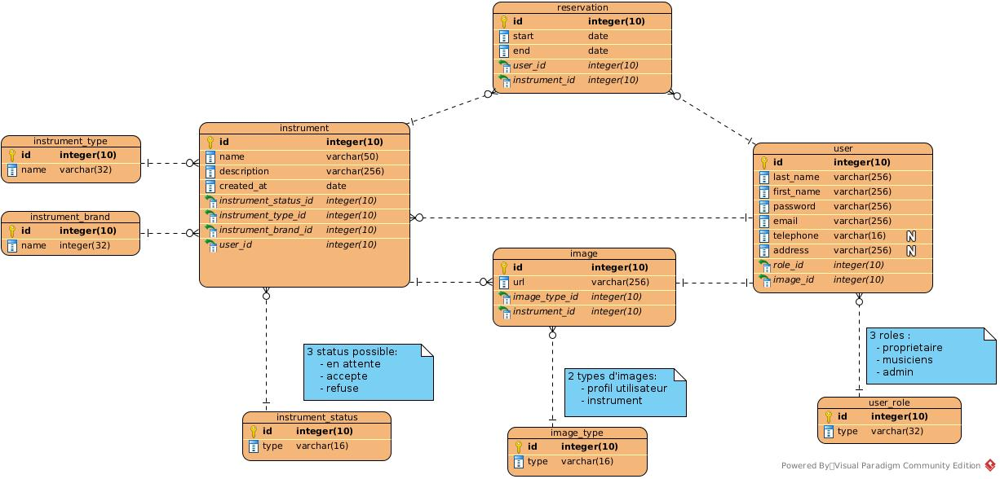

<link rel="stylesheet" href="style.css"/>

[&#8592;](./2-analyse.md)

# Modelisation de base de données

Dans cette partie je vais modeliser la base de données en fonction des entitées metiers de l'app 
Les 3 grandes entitees de cette application sont :
- les utilisateurs
- les reservations 
- les instruments
- la messagerie interne

Les autres entitees sont surtout utilisees pour completer les 3 principales (photo, role...). 
Egalement afin d'organiser les donnees et d'eviter les doublons. 

La modelisation sera realisée sur visual paradigm 

 

