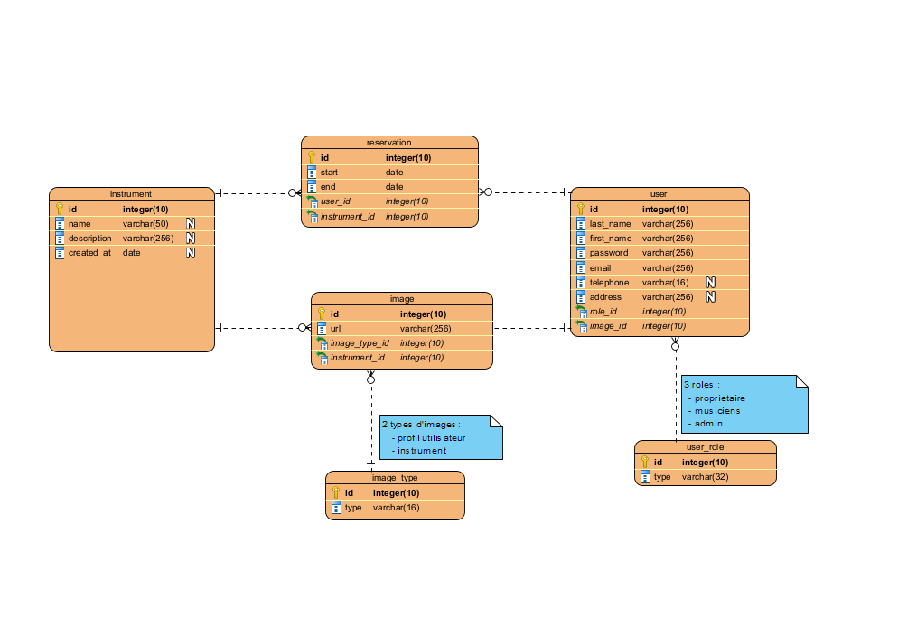

# Modelisation de base de données

Dans cette partie je vais modeliser la base de données en fonction des entitées metiers de l'app 
La modelisation sera realisée sur visual paradigm 
liste des entitees:
- Utilisateur 
 

