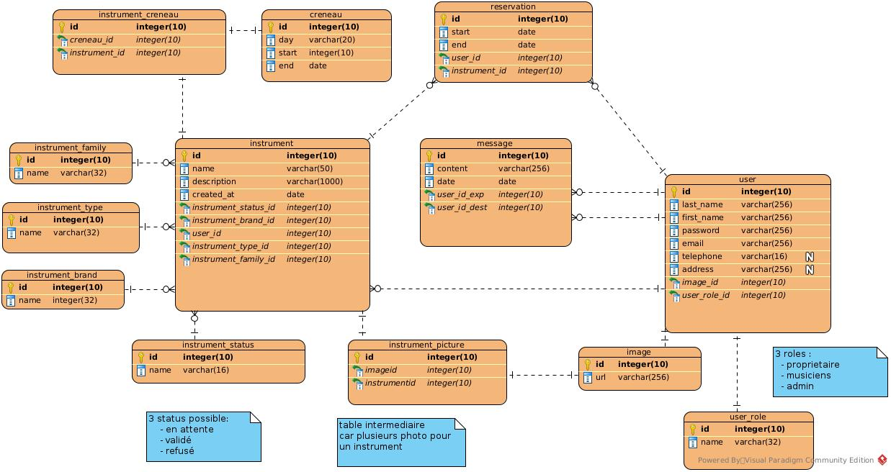

<link rel="stylesheet" href="style.css"/>

[&#8592;](./2-analyse.md)

# Modelisation de base de données

Dans cette partie je vais modeliser la base de données en fonction des entitées metiers de l'app 
Les 3 grandes entitees de cette application sont :
- les utilisateurs
- les reservations 
- les instruments
- la messagerie interne

Les autres entitees sont surtout utilisees pour completer les 3 principales (photo, role...). 
Egalement afin d'organiser les donnees et d'eviter les doublons. 

La modelisation sera realisée sur visual paradigm 

 

 

## Description des tables importantes

L'abreviation **FK** designe un champs clef etrangere

### <u>reservation</u>

cette table represente les informations d'un creneaux de reservation et contient les champs suivant:
- id: int (index)
- date de debut: date
- date de fin: date
- id du musicien prenant le creneaux: int (FK)
- id de l'instrument: int (FK)

### <u>instrument</u>

cette table represente un instrument contient les champs suivant:
- id: int (index)
- nom: varchar
- description: varchar
- date de creation par le proprietaire: date
- status actuel: int (FK)
- le type: int (FK)
- la famille: int (FK)
- la marque: int (FK)
- l'id du proprietaire: int (FK)

### <u>utilisateur</u>

cette table represente un utilisateur et contient les champs suivants:
- id: int (index)
- nom: varchar
- prenom: varchar
- mot de passe: varchar 
- email: varchar
- telephone: varchar
- adresse: varchar
- l'id role sur l'app: int (FK)
- l'id de l'image de profil: int (FK)

### message

cette table represente un message et contient les champs suivants:
- id: int (index)
- le corps du message: varchar
- la date d'envoie: date
- l'id du destinataire: int (FK)
- l'id de l'expediteur: int (FK)

  