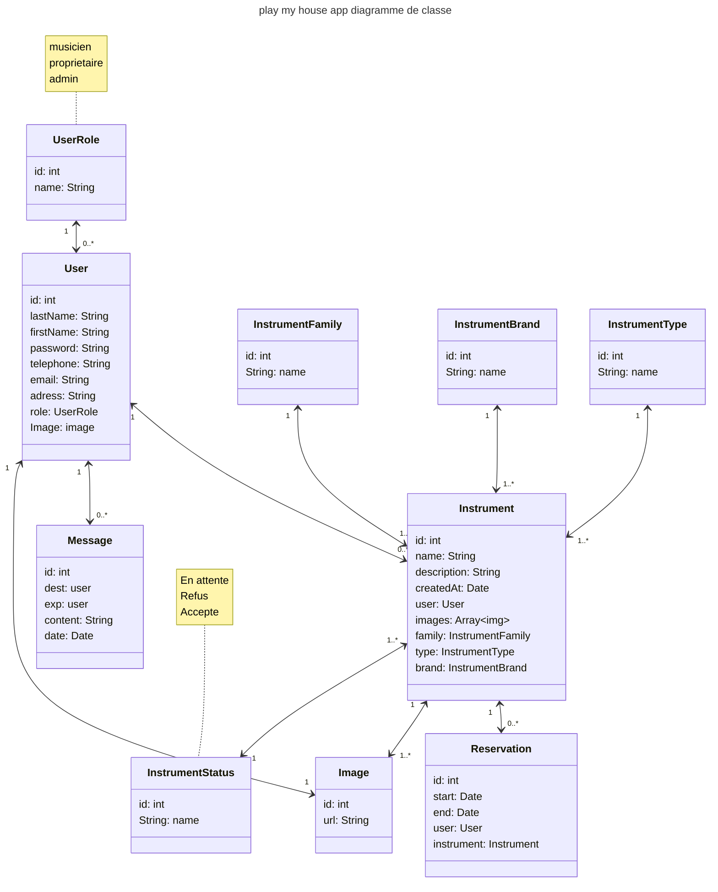

<link rel="stylesheet" href="style.css"/>

[&#8592;](./2-analyse.md)

```mermaid
    ---
title: play my house app diagramme de classe 
---
classDiagram
    User "1" <--> "0..*" Instrument
    Instrument "1" <--> "0..*" Reservation 
    User "1" <--> "0..*" Message
    UserRole "1" <--> "0..*" User
    InstrumentFamily "1" <--> "1..*" Instrument
    InstrumentBrand "1" <--> "1..*" Instrument
    InstrumentType "1" <--> "1..*" Instrument
    Image "1" <--> "1" User
    Instrument "1" <--> "1..*" Image
    Instrument "1..*" <--> "1" InstrumentStatus
    note for InstrumentStatus "En attente
                                Refus
                                Accepte"
    note for UserRole "musicien
                        proprietaire
                        admin"

    class Reservation {
        id: int
        start: Date
        end: Date
        user: User
        instrument: Instrument
    }

    class User {
        id: int
        lastName: String 
        firstName: String 
        password: String 
        telephone: String
        email: String 
        adress: String 
        role: UserRole
        Image: image
    }

    class Message {
        id: int
        dest: user
        exp: user
        content: String
        date: Date
    }

    class Instrument {
        id: int 
        name: String 
        description: String 
        createdAt: Date 
        user: User
        images: Array<Image>
        family: InstrumentFamily
        type: InstrumentType
        brand: InstrumentBrand

    }

    class UserRole {
        id: int
        name: String
    }

    class InstrumentFamily {
        id: int
        String: name
    }

    class InstrumentType {
        id: int
        String: name
    }

    class InstrumentBrand {
        id: int
        String: name
    }

    class InstrumentStatus {
        id: int
        String: name
    }

    class Image {
        id: int
        url: String
    }


```