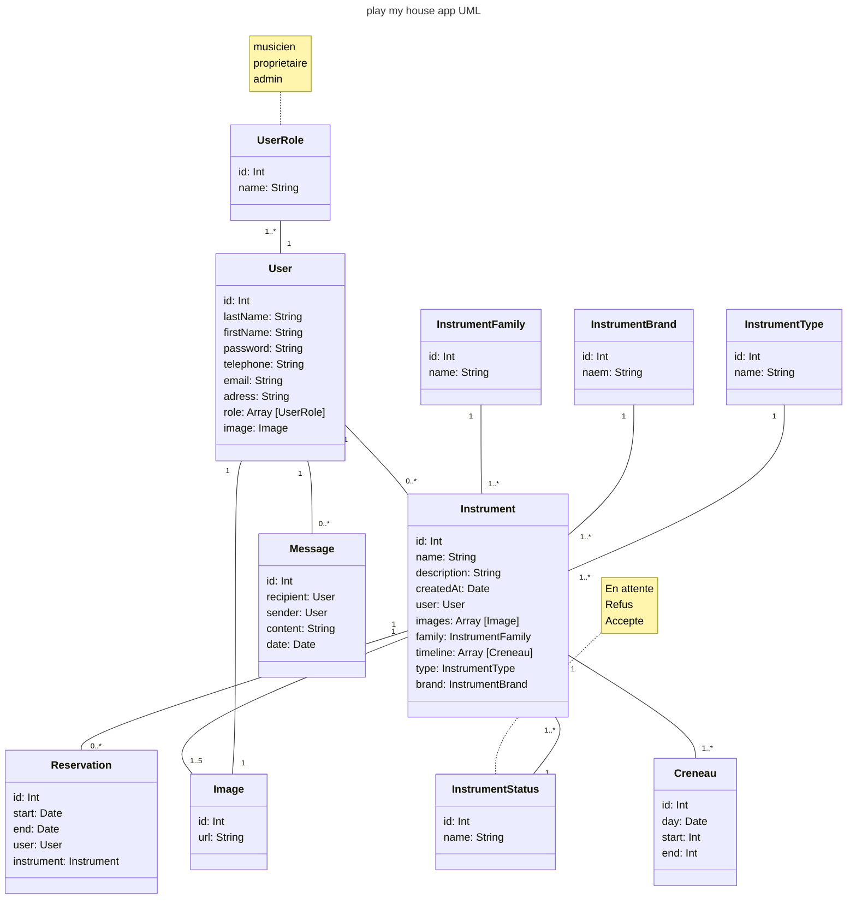

<link rel="stylesheet" href="style.css"/>

[&#8592;](./2-analyse.md)

Le diagramme UML est utilise pour representer les differentes classes et leurs attributs ( eventuellement les methodes). 
Ainsi que les relations d'heritage. 
On l'utlise pour decouper le programme en differentes classes / fonctionnalitees
 
  

