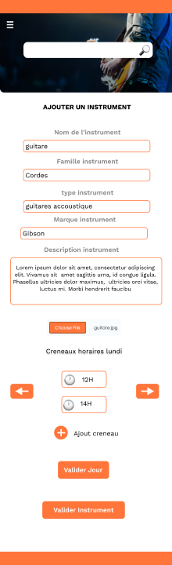

<link rel="stylesheet" href="../style.css"/>

[
&#8592;](../2-2-ecrans.md)

# Ecran ajout instrument

 
Sur cette page l'utilisateur doit remplir un formulaire pour decrire son instrument et les disponibilitees<br\>
Il sera donc invite a rentrer le nom, la famille, le type, la marque et une courte description de son instrument. 
Il pourra egalement ajouter des image avec le bouton d'upload. 
Ensuite vient la partie de selection des creneaux par jour d'une semaine type. 
Il pourra ajouter des creneaux de reservation pour son instrument aux jours qui lui conviennent. 
Les differents boutons servent au processus d'ajout de creneaux: 
- navigation dans les jours de la semaine 
    - validation du creneau actuel 
    - validation du jour actuel 
A la fin l'utilisateur doit valider la creation de l'instrument.
