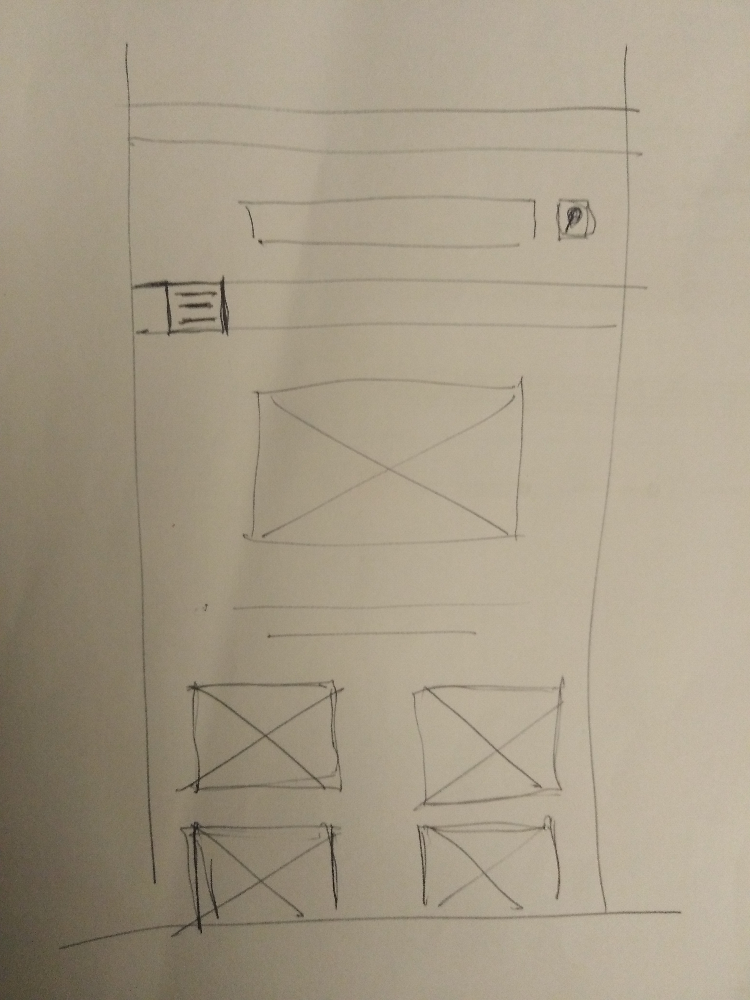

<link rel="stylesheet" href="../style.css"/>

[
&#8592;](../2-analyse.md)

# Ecran page d'accueil

En haut de la home page une barre de recherche rapide d'instrument. 
en dessous une icone burger pour etendre le menu de l'application pour naviguer
dans les differents ecrans. 
Ensuite un caroussel avec differentes images et un tesxte de presentation du site. 
S'en suit la liste en image des 10 derniers instruments arrives sur la plateforme 
Si l'utilisateur clique sur un instrument, il sera redirge sur la page de detail.