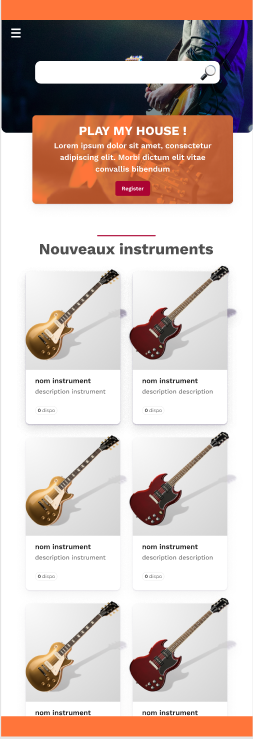

<link rel="stylesheet" href="../style.css"/>

[
&#8592;](../2-2-ecrans.md)

# Ecran page d'accueil

 
 

 
 
En haut de la home page une barre de recherche rapide d'instrument. 
au dessus une icone burger pour etendre le menu de l'application pour naviguer
dans les différents écrans. 
<a href="https://tailwindcomponents.com/component/navbar-hamburger-menu">exemple composant menu burger</a> 
Ensuite un encart avec un texte plus un bouton pour s'enregistrer. 
S'en suit la liste en image des 10 derniers instruments arrivés sur la plateforme 
Si l'utilisateur clique sur un instrument, il sera redirigé sur la page de detail de l'instrument.