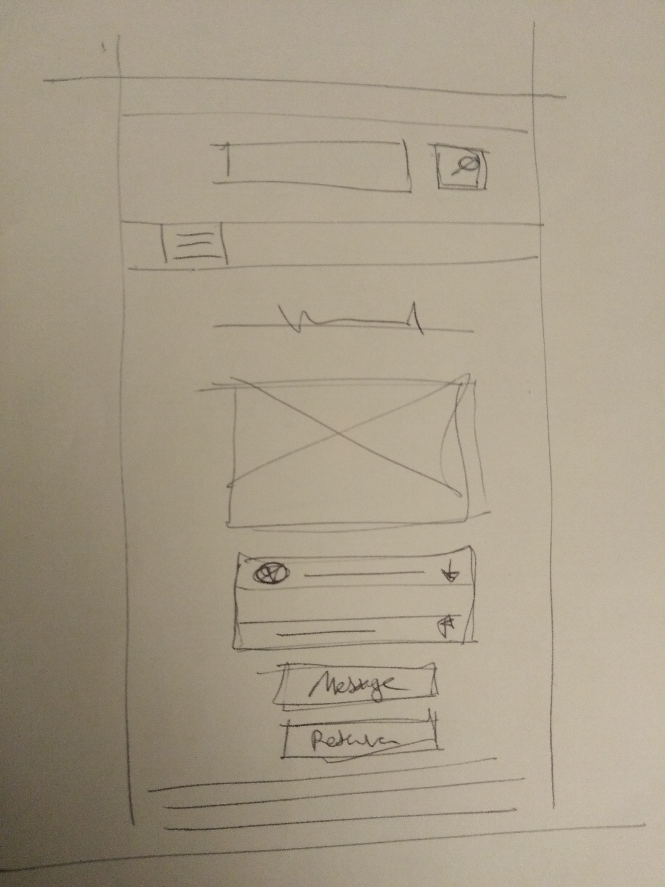

<link rel="stylesheet" href="../style.css"/>

[
&#8592;](../2-analyse.md)

# Ecrans detail d'un instrument

 
 
Sur cette page on retrouve la recherche rapide et le menu burger. 
En dessous le nom de l'instrument et sa photo. 
Apres un encart type accordeon avec les infos sur le proprietaires (nom, adresse..) 
S'en suit un duo de bouton:
-   Si l'utilisateur clique sur **message** il pourra demander au proprietaire des infos.
-   Le bouton **reserver** redirige vers l'ecran de reservation des creneaux.
  
Cette ecran se termine par une description de l'instrument, elle est redige par le proprietaire lors de l'ajout de l'instrument.