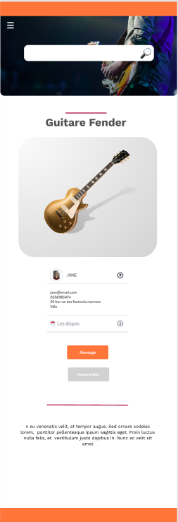

<link rel="stylesheet" href="../style.css"/>

[&#8592;](../2-2-ecrans.md)

# Ecran détail d'un instrument #

 
 

 
 
Sur cette page on retrouve la recherche rapide et le menu burger. 
En dessous le nom de l'instrument et sa photo. 
Apres un encart type <a href="https://flowbite.com/docs/components/accordion/">accordéon</a> contenant les infos sur le propriétaire (nom, adresse..) 
ainsi que les dispos de l'instrument 
S'en suit un duo de bouton: 
- Si l'utilisateur clique sur ** message** il pourra demander au propriétaire des infos. 
- Le bouton **réservation** ouvre un <a href="https://tw-elements.com/docs/standard/forms/datepicker/">date picker</a> apres avoir choisi une date la popup ecran de reservation des creneaux s'ouvre.
  
Cette écran se termine par une description de l'instrument, elle est rédié par le propriétaire lors de l'ajout de l'instrument.