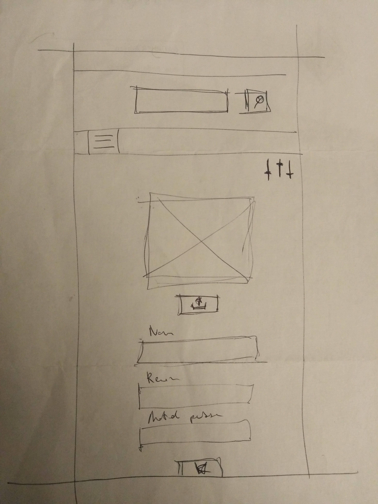

<link rel="stylesheet" href="../style.css"/>

[
&#8592;](../2-2-ecrans.md)

# Page profil

 
En plus du classique duo barre de recherche et menu burger la page profil est composee d'un bouton **settings** en haut a droite. 
Il permet a l'utilistateur de naviguer dans on espace personnel. 
Un proprietaire pourra acceder a ses differentes annonces et reservations. 
Un musicien pourra consulter l'historique de ses reservations et les nouvelles. 
Tous deux pouraont modifier leur profil et consulter/envoyer des messages. 
Sur cette vue on peut voir les details du compte, photo de profil et bouton **upload** our en changer 
S'en suit les infos sur l'utilisateurs (nom, mdp, email ..). 
Avec possibilitee de les modifier