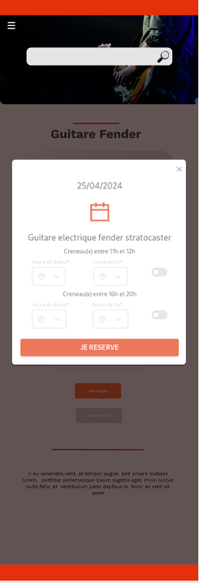

<link rel="stylesheet" href="../style.css"/>

[&#8592;](../2-analyse.md)

# ECRAN RESERVATION CRENEAU

 
Cette popup s'ouvre au moment ou l'utilisateur a choisit une date pour sa reservation. 
Il ne lui reste plus qu'a choisir un creneau horaire. 
Une fois choisit et valider, un message lui sera envoyer sur la messagerie de l'application. 